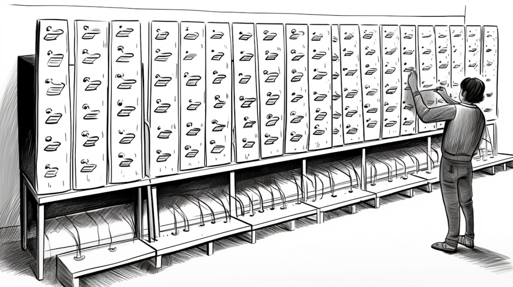

```{r setup, include=FALSE}
usethis::use_git_ignore(c("*.csv", "*.rds"))
options(htmltools.dir.version = FALSE)

library(knitr)
library(tidyverse)
library(xaringan)
library(fontawesome)
```

class: inverse, center, middle

# `r fa("fas fa-images", fill = "#fff")`

**View the slides:** 

[bretsw.com/edf5442-ss24-module5](https://bretsw.com/edf5442-ss24-module5)

---

class: inverse, center, middle

# Standup

```{r, out.width = "100%", echo = FALSE, fig.align = "center"}
include_graphics("img/standup.png")
```

---

class: inverse, center, middle

# `r fa("fas fa-comments", fill = "#fff")` <br><br> What are you up to <br> for Spring Break?

---

# `r fa("fas fa-comments", fill = "#fff")` Spring Break

```{r, out.width = "600px", echo = FALSE, fig.align = "center"}

```

--

- 3 minutes: Sketch out questions to ask.

--

- 5 minutes: Conduct interview.

--

- 5 minutes: Switch. Conduct interview.

---

# `r fa("fas fa-comments", fill = "#fff")` Spring Break

```{r, out.width = "600px", echo = FALSE, fig.align = "center"}

```

- What was it like? What felt uncomfortable or awkward?

--

- How well did you take advantage of the methdology?

--

- Who steered the conversation?


---

class: inverse, center, middle

# `r fa("fas fa-comments", fill = "#fff")` <br><br> Intro to Interviews

---

# `r fa("fas fa-comments", fill = "#fff")` Interviewing

```{r, out.width = "600px", echo = FALSE, fig.align = "center"}

```

### `r fa("fas fa-book-open-reader", fill = "#782F40")` Selecting Appropriate Data Collection Methods (O'Leary, 2005, Ch. 6)

--

**The Question and Answer Process: Interviewing** (O'Leary, 2005, pp. 113-119)

--

- Asking, or Listening? (p. 113)

---

# `r fa("fas fa-comments", fill = "#fff")` Interviewing

```{r, out.width = "600px", echo = FALSE, fig.align = "center"}

```

### `r fa("fas fa-book-open-reader", fill = "#782F40")` Selecting Appropriate Data Collection Methods (O'Leary, 2005, Ch. 6)

**The Question and Answer Process: Interviewing** (O'Leary, 2005, pp. 113-119)

- Ask questions that facilitate answers (p. 118)

--

- Keep it flowing / Keep on track

---

# `r fa("fas fa-comments", fill = "#fff")` Interviewing

```{r, out.width = "600px", echo = FALSE, fig.align = "center"}

```

### `r fa("fas fa-book-open-reader", fill = "#782F40")` Selecting Appropriate Data Collection Methods (O'Leary, 2005, Ch. 6)

**The Question and Answer Process: Interviewing** (O'Leary, 2005, pp. 113-119)

- Explore deeper and wider (p. 119)

--

- Follow up: Why? Could you give me an example? Tell me more about that...

---

# `r fa("fas fa-comments", fill = "#fff")` Interviewing

```{r, out.width = "600px", echo = FALSE, fig.align = "center"}

```

**Benefits of Interviewing:** (O'Leary, 2005, p. 114)

--

- Develop rapport and trust

--

- Get rich, in-depth details with some structure

--

- Observe nonverbal data too

---

# `r fa("fas fa-comments", fill = "#fff")` Interviewing

```{r, out.width = "600px", echo = FALSE, fig.align = "center"}

```

**Challenges of Interviewing:** (O'Leary, 2005, p. 114)

--

- Avoid leading participants

--

- Avoid having participants trying to impress you

--

- Attend to demographic and cultural factors that might shape responses

---

# `r fa("fas fa-comments", fill = "#fff")` Interviewing

```{r, out.width = "600px", echo = FALSE, fig.align = "center"}

```

**Challenges of Interviewing:** (O'Leary, 2005, p. 114)

- Limited to a small sample, and issues of sampling

--

- Lack of anonymity

---

# `r fa("fas fa-comments", fill = "#fff")` Interviewing

```{r, out.width = "600px", echo = FALSE, fig.align = "center"}

```

**Types of Interviews:** (O'Leary, 2005, Table 6.2, pp. 116-117)

--

- Formal vs. Relaxed?

--

- Structured vs. Free-Flowing?

--

- One-on-one vs. Focus Group?


---

class: inverse, center, middle

# Project Teams

```{r, out.width = "100%", echo = FALSE, fig.align = "center"}
include_graphics("img/scrum.png")
```

**Start to talk through developing your interview protocol...**


---

class: inverse, center, middle

# Sorting

```{r, out.width = "100%", echo = FALSE, fig.align = "center"}

```

---

class: inverse, center, middle

# Scrum Teams

```{r, out.width = "100%", echo = FALSE, fig.align = "center"}
include_graphics("img/scrum.png")
```

**Final look at survey instrument...**


---

class: inverse, center, middle

# Standup

```{r, out.width = "100%", echo = FALSE, fig.align = "center"}
include_graphics("img/standup.png")
```

---

class: inverse, center, middle

# `r fa("fas fa-binoculars", fill = "#fff")` <br><br> Looking ahead

---

# `r fa("fas fa-calendar-day", fill = "#fff")` Semester Schedule

```{r, out.width = "360px", echo = FALSE, fig.align = "center"}
include_graphics("img/across-time.jpg")
```

- ~~Module 1: Introduction to Inquiry~~

- ~~Module 2: Reviewing the Literature~~

- ~~Module 3: Planning for Inquiry~~

- ~~Module 4: Measurement: Surveys & Tests~~

- **Module 5: Measurement: Interviews**

- **Module 6:** Analysis: Quantitative - **Deploy survey after March 27 class**

- **Module 7:** Analysis: Qualitative

- **Module 8:** Ethics & Reporting

---

# `r fa("far fa-keyboard", fill = "#fff")` Major Assignments

```{r, out.width = "240px", echo = FALSE, fig.align = "center"}
include_graphics("img/build.jpg")
```

### Individual Assignments (20%)

- ~~Problem Statement and Annotated Bibliography (10%)~~
- **Test Items** (10%) - due in Module 7

### Group Assignments (50%)

- ~~Inquiry Plan** (5%)~~
- ~~Survey Instrument (10%)~~
- **Interview Protocol (10%) - due in Module 6**
- **Survey Reflection & Write-up** (10%) - due in Module 8
- **Final Report** (15%) - due at end of semester

### Participation (30%)

- **Weekly Class Activities** (2% each week)

---

class: inverse, center, middle

# `r fa("fas fa-question", fill = "#fff")` <br><br> Questions

<hr>

**What questions can I answer for you now?**

**How can I support you this week?**

<hr>

`r fa("fas fa-envelope", fill = "#fff")` [bret.staudtwillet@fsu.edu](mailto:bret.staudtwillet@fsu.edu) | `r fa("fas fa-globe", fill = "#fff")` [bretsw.com](https://bretsw.com) | `r fa("fab fa-github", fill = "#fff")` [GitHub](https://github.com/bretsw/)